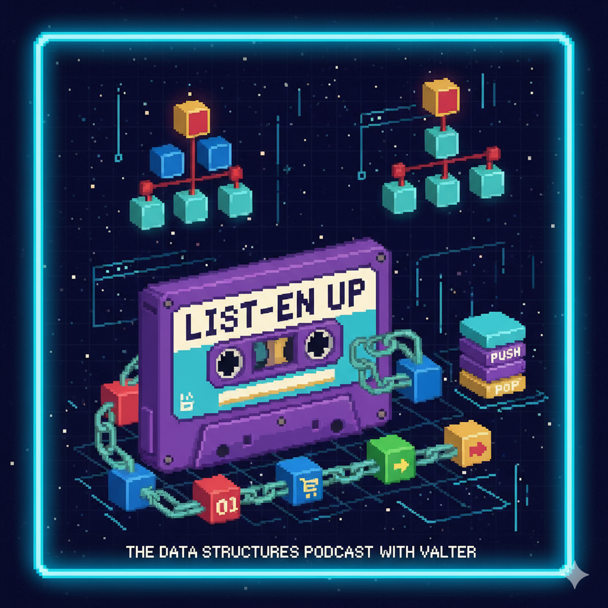

<h1 align="center">
  List-en Up - A Podcast About Data Structures and Puns
</h1>

🎧 [Episode 1 - Lists](https://raw.githubusercontent.com/AxeWalter/dio-AIPodcast/main/output/episode1.mp3)

## 💻 Techs Used in this Project

- [ElevenLabs](https://beta.elevenlabs.io/)
- [Gemini](https://gemini.google.com/app)

## ✨ Steps

- Name and script generated with Gemini
- Audio generated with elevenLabs
- Image generated with Gemini

## 📚 This was created as part of the DIO Generative AI Fundamentals Course

- [Link da live no Youtube](https://www.youtube.com)
- [Notion Template](https://helpful-jump-17b.notion.site/PAS-Podcast-AI-Studio-210489e15d7a4a73b743bb159e45d06f?pvs=4)
- [Editor de aúdio](https://www.capcut.com/editor?from_page=landing_page&__action_from=picture_V%C3%ADdeos%20profissionais%20em%20minutos,%20n%C3%A3o%20em%20horas.)
- Teacher Felipe Aguiar socials:
  - [GitHub](https://github.com/felipeAguiarCode)
  - [LinkedIn](www.linkedin.com/in/felipe-exe)
  - [Instagram](https://www.instagram.com/felipeaguiar.exe/)
